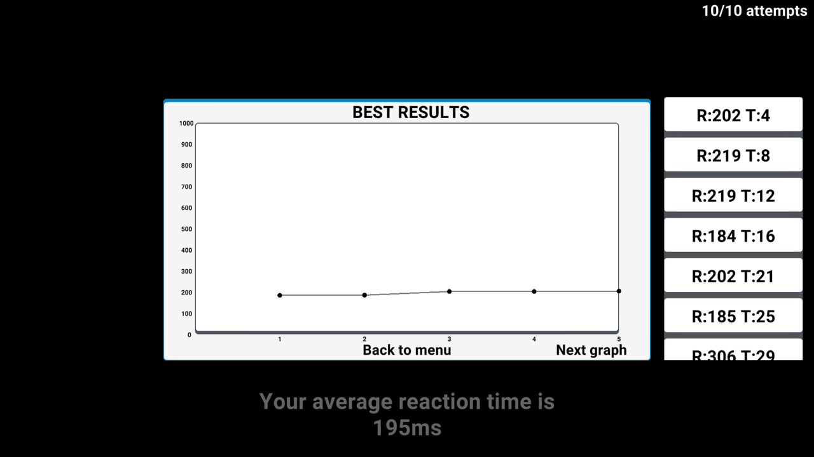

# Руководтсво по программе тестирования сенсорной чувствительности и двигательных реакций человека для обычного пользователя
## 1.ОСЁТР CLOUD:
### Вход в ОСЁТР CLOUD
**Для прохождения тестирований вам необходимо создать или войти в свой аккаунт ОСЁТР INDUSTRIES.**
**Вход в аккаунт происходит при помощи пароля и почты, так что при создании аккаунта не забывайте свои данные для входа.**

### Регистрация в ОСЁТР CLOUD
**При регистрации в ОСЁТР CLOUD вы должны указать своё имя, фамилию, пол и возраст. Эти данные используются для сбора статистики, а также для оценки результатов тестирования.**
**Если вы не хотите указывать свои настоящие имя/фамилию, то можете указать псевдоним, однако данные о поле и возрасте должны быть достоверными, так как от них зависят нормы времени реакции.**

## 2.Настройка теста:
**После входа в ОСЁТР CLOUD вы попадёте на экран настройки теста**

## 3.Выбор варианта тестирования:
**Для того чтобы выбрать вариант тестирования, нажмите на кнопку в верхнем левом углу (рис.1 ), затем из списка выберите нужный вам вариант(рис.2)**

 **рис.1**
 **рис.2**

 ## 4.Настройка теста:
**Для того чтобы установить количество попыток, заполните соответствующее поле(рис.3), если вы оставите поле пустым, то количество попыток будет установлено на 5, также если вы хотите установить время, свыше которого результаты будут игнорироваться, заполните соответствующее поле, указав время в секундах(рис.4), если вы оставите это поле пустым, то лимит будет установлен на 1 секунду.**

**рис.3**
**рис.4**

**Если вы выбрали вариант теста picture(tap), то вы также сможете настроить размер картинки с помощью соответствующего слайдера(рис.5). Увидеть текущий размер можно в нижнем левом углу.**

**рис.5**

***Также важно знать, что если вы проходите тест на мобильном устройстве, то все звуковые тесты без подключённых наушников вы не сможете начать, а на пк вариант с вибрацией будет недоступен.***

## 5.Варианты теста:
**Picture(tap) — это стандартный вариант теста, в котором вам нужно нажимать на экран (если вы проходите с мобильного устройства, но и на пк это тоже будет работать) или на клавишу пробел (с пк соответственно), как только вы увидите белый квадратик, появляющийся на 20 миллисекунд.**

**Picture (release) - в этом варианте теста вам нужно будет нажать и удерживать палец или левую кнопку мыши на экране. Если вы всё сделаете правильно, то экран окраситься в бледно белый цвет. После этого продолжайте удерживать до тех пор, пока экран не станет ярко-белым. Как только он станет таким отпускайте как можно быстрее. Повторяйте эти действия до конца теста.**

**Sound(mono) - в этом варианте теста нужно делать тоже, что и в picture(tap) варианте теста, за тем исключением, что вместо картинки будет проигрываться звук 20 миллисекунд.**  

**Sound(stereo) - этот вариант теста обязательно нужно проходить в наушниках, так как проверяется время реакции для каждого уха. Как только вы услышите звук, вам нужно будет определить в каком наушнике он проиграл (левом или правом) и в зависимости от этого нажать на левую сторону экрана / левую стрелочку на клавиатуре для левого уха и правую сторону экрана / правую стрелочку на клавиатуре для правого. Повторять до завершения теста. Также важно знать, что если вы ошиблись со стороной, то попытка не будет засчитана.** 

**Vibration - этот вариант доступен только для мобильных устройств, в нём надо будет нажимать то же что и в picture(tap) варианте теста, но только тогда, когда вы почувствуете вибрацию.**  

## 6.Конец теста
**По завершению теста вам будут предоставлены два графика, результаты ваших попыток и среднее время реакции. Первый график будет отображать лучшие попытки, а второй будет отображать все.  Для переключения между графиками используйте кнопки "Previous graph" и "Next graph" для переключения на предыдущий с следующий график соответственно. Кнопка "Back to menu" вернёт вас в меню настройки теста.  Также в верхнем правом углу будет список всех результатов, который нужно пролистнуть вверх или вниз для того, чтобы просмотреть результаты всех попыток, а среднее время реакции будет отображаться в правом нижнем углу.**
 **Пример экрана после завершения теста с графиком лучших результатов**

## 7.Анализ результатов
**Рассмотрим для начала панель со всеми результатами. Для каждого отдельного результата используется отдельная панель с текстом. Результат в ней записывается так: R (время реакции) + время реакции в миллисекундах + T (время от начала теста) + время от начала теста в секундах. Теперь обратим внимание на график всех результатов. Чем ровнее график, тем лучше вы справились с тестом. Также важно заметить, что если вы проходите тест в первый раз, то для более точного результата его надо будет пару раз перепройти, пока график всех результатов не станет максимально ровным. Также после прохождения теста и просмотра всех графиков, вы попадёте на экран анализа результатов. Здесь вы увидите краткую оценку своего результата тестирования, а также рекоммендаци. о необходимости перепрохождения теста.**

** — пример панели результата попытки.**

 **Пример экрана с анализом результатов**
 
 # Руководтсво по программе тестирования сенсорной чувствительности и двигательных реакций человека для врача или специалиста
 **После регистрации в ОСЁТР CLOUD для получения статуса врача / специалиста обращайтесь на почту ocetr.industries@gmail.com
 После получения статуса врача / специалиста, вам необходимо добавить пользователей, результаты прохождений тестирования которых вы будете отслеживать и оценивать. Для того
 чтобы добавить пользователя, вам нужно знать его уникальный идентификатор(пример идентификатора: ttCPGcVq2JUJRNWRQjlehnrnyUV2) того, кого вы хотите добавить. Узнав данный
 идентификатор, войдите в свой аккаунт, нажмите кнопку "Add patient" и в графу "Enter patient id..." введите идентификатор пациента.**
 

**После того как вы начали отслеживать как минимум одного пользователя, вы сможете ознакомиться с результатами последнего тестирования выбранного пользователя. Нажав кнопку 
"Expand" вы сможете открыть более подробный отчёт тестирования**

**При необходимости вы также сможете добавить авторский анализ результата тестирования или какие-либо рекомендации в графах "Reaction time analysis" и "Recommendations" соответсвенно**
